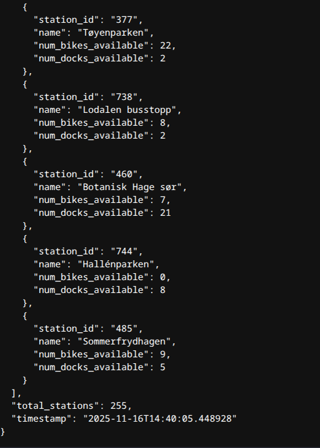

# City Bike REST API
This Python REST API uses the public availible oslobysykkel API to fetch data about the city bikes in Oslo.

It then extracts the station names and ids, and also the number of availible bikes and locks for each station. It serves this as a JSON format to
- http://localhost:5000/bike_status

Oslo Bysykkel API recommends the use of the Client-Identifier header that should be in the format of company_name dash(-) application_name e.g mittfirma-bymonitor. Environment variable CLIENT_IDENTIFIER can be set in docker compose file in order to change the default value.

## Development environment
- OS: Nobara Linux 42 64-bit
- Kernel: 6.17.5-200.nobara.fc42.x86_64
- Python version: 3.13.9

# Quick start
Explains the steps needed to get the API up and running.

> [!NOTE]
> The application has only been tested on Linux based systems, specifycally Fedora based systems.

## Prerequisites
- Docker
- Docker compose
- Python version 3.13 or later (if you want to run dev server or tinker with the code)

## Clone the repository
```bash
# Clone git repo
git clone https://github.com/nimkha/city_bike.git
# Change directory to new cloned repo
cd city_bike
```

## Running with docker compose
To perform these commands you need to be in the project roor directory.

If you are having issues running docker commands without sudo and wish to do so you can check out
- https://docs.docker.com/engine/install/linux-postinstall/ fast, but not recommended
- https://docs.docker.com/engine/security/rootless/ recommended

### Build the image
```bash
docker compose build
```
Expected output should look like
```bash
$ docker compose build
[+] Building 11.2s (14/14) FINISHED
 => [internal] load local bake definitions                                   0.0s
 => => reading from stdin 543B                                                0.0s
 => [internal] load build definition from Dockerfile                         0.0s
 => => transferring dockerfile: 708B                                          0.0s
 => [internal] load metadata for docker.io/library/python:3.13               0.5s
 => [internal] load .dockerignore                                            0.0s
 => => transferring context: 130B                                            0.0s
 => [internal] load build context                                            0.0s
 => => transferring context: 386B                                            0.0s
 => [1/7] FROM docker.io/library/python:3.13@sha256:b9cda9bd6a5e14ee6074368dd1df871e969912bbc5c1754c761f92a11e2c6082   0.0s
 => CACHED [2/7] RUN apt update && apt install -y --no-install-recommends ca-certificates && rm -rf /var/lib/apt/lists/*   0.0s
 => CACHED [3/7] RUN groupadd -g 1000 appgroup && useradd -u 1000 -g 1000 -m appuser   0.0s
 => CACHED [4/7] WORKDIR /app                                                 0.0s
 => [5/7] COPY requirements.txt .                                             0.0s
 => [6/7] RUN pip install --no-cache-dir -r requirements.txt                  9.3s
 => [7/7] COPY app/ ./app/                                                    0.0s
 => exporting to image                                                        1.2s
 => => exporting layers                                                       1.2s
 => => writing image sha256:1f1022d3b120aa77c6b50e1b1b6848b62210bba5cef09426ae1c253eff5744b6   0.0s
 => => naming to docker.io/library/city_bike-city-bike-api                    0.0s
 => resolving provenance for metadata file                                    0.0s
[+] Building 1/1
 ✔ city_bike-city-bike-api  Built                                            0.0s
```

### Start the container (in detached mode)
```bash
docker compose up -d

# You can also check some status information with
docker compose ls
docker compose ps
```

Expected output should look like

```bash
$ docker compose up -d
[+] Running 2/2
 ✔ Network city_bike_default  Created                               0.1s
 ✔ Container city-bike-api   Started                               0.1s

~ /Projects/city_bike$ docker compose ls
NAME        STATUS        CONFIG FILES
city_bike   running(1)    /home/nima/Projects/city_bike/docker-compose.yml

~ /Projects/city_bike$ docker compose ps
NAME           IMAGE                     COMMAND                SERVICE        CREATED          STATUS          PORTS
city-bike-api  city_bike-city-bike-api   "gunicorn -w 2 -b 0.…" city-bike-api  21 seconds ago   Up 20 seconds   0.0.0.0:5000->5000/tcp, [::]:5000->5000/tcp
```

#### At this point you will be able to reach
- Bike status – http://localhost:5000/bike_status
- Swagger UI – http://localhost:5000/apidocs/

### View logs
```bash
docker compose logs -f
```

Expected output should look like
```bash
~ /Projects/city_bike$ docker compose logs -f
city-bike-api  | [2025-11-16 19:14:55 +0000] [1] [INFO] Starting gunicorn 22.0.0
city-bike-api  | [2025-11-16 19:14:55 +0000] [1] [INFO] Listening at: http://0.0.0.0:5000 (1)
city-bike-api  | [2025-11-16 19:14:55 +0000] [1] [INFO] Using worker: sync
city-bike-api  | [2025-11-16 19:14:55 +0000] [8] [INFO] Booting worker with pid: 8
city-bike-api  | [2025-11-16 19:14:55 +0000] [9] [INFO] Booting worker with pid: 9
city-bike-api  | 2025-11-16T19:15:34+0000 INFO app.api Successfully processed request to https://gbfs.urbansharing.com/oslobysykkel.no/station_information.json
city-bike-api  | 2025-11-16T19:15:34+0000 INFO app.api Successfully processed request to https://gbfs.urbansharing.com/oslobysykkel.no/station_status.json
```

### Stopping the application
```bash
docker compose down
```

Expected output should look like
```bash
~ /Projects/city_bike$ docker compose down
[+] Running 2/2
 ✔ Container city-bike-api   Removed                               0.3s
 ✔ Network city_bike_default Removed                              0.2s
 ```

# Accessing API
After the application is up and running you will be able to access endpoints /bike_status and /apidocs/ from a regular browser.

- http://localhost:5000/apidocs/ \
Is used for Swagger documention

- http://localhost:5000/bike_status \
This is the endpoint that gives the actual city bike information in a JSON format.

Expected output should look like \


# TODO
Even though the API works as it is now there are a couple of things I would like to look at before calling it done.

## Optimazation and code refactoring (more lambdas)
As the code is written now it is room to make it in fewer lines. One way of achieving that is with e.g lambdas. \

## JSON web tokens
For enhached security adding JWT is a possiblity so there is a need for user authentication to be able to access the API. If this is neceserray or not is another question.

## Implement Github actions to run unittests
In order to automate the running of test we could implement Github actions to run each time data is pushed to the repo.

## Enhancing Output With Rich
Rich is a python library allowing much nicer log output in terminal. This would make it more userfriendly and readable.

## Check the need for adding a health check URL
Adding a health check with something like /healt_check returing "OK" could also be an option if needed. This would make it easy to add to monitoring later.

## Save logs to file
As of now the logging is only sent to the terminal. It might be needed that the logs are saved to a file.

## Make use of env variables
Instead of hardcoing the URL strings in the code as it is now we can move them to env variables enabling us to specify in docker compose file the URLs

## Add https
Need to later add certification handling.
